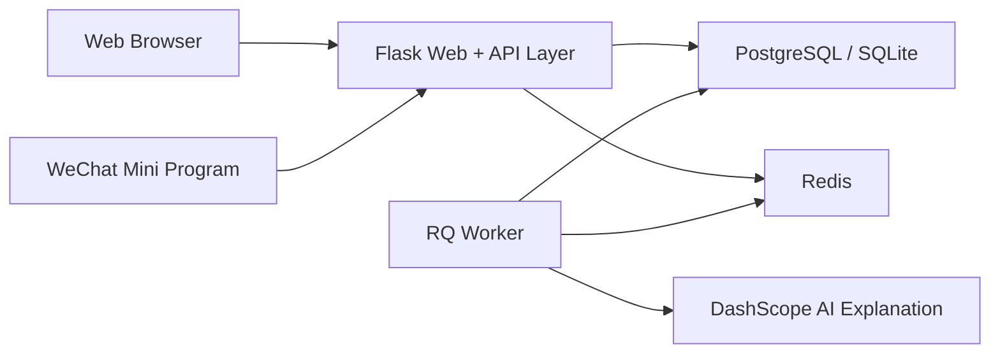

# Ti Question Bank System (Competition Edition)

> Project brief for the China College Computer Design Competition, Software Application & Development — Web Application track.  
> Root overview: [README.md](README.md) · Chinese version: [README.zh-CN.md](README.zh-CN.md)

## 1. Project Overview

Ti is a single-repository full-stack system built for exam preparation, question-bank operations, and learning analytics.

Its verified implementation profile is summarized below:

| Dimension | Description |
| --- | --- |
| Competition focus | **Web application**, built with Flask + Jinja templates + vanilla JS/CSS |
| Mobile extension | **Native WeChat Mini Program** using TypeScript + Less as a companion client sharing the same backend semantics |
| Backend structure | Flask application factory + modular Blueprints |
| Data & infrastructure | Docker-based development with PostgreSQL 16 + Redis 7 + RQ Worker |
| API style | `status / code / data / message` envelope |
| Authentication | Session for Web, JWT Bearer Token for Mini Program / API |
| Default runtime | Docker development workflow driven by `compose.dev.yml` |

This repository is not a split frontend-backend multi-repo setup, and it is not a SPA plus a separate API service. It is a unified Flask-centered business system serving both the Web interface and the Mini Program companion.

## 2. Competition Positioning and Problem Context

The project targets a combined scenario of question-bank management, practice workflows, learning feedback, and platform operations. Common issues in exam-preparation tools include:

- fragmented public banks and personal banks;
- disconnected records for favorites, mistakes, progress, and exams;
- inconsistent semantics between administration-oriented Web systems and mobile learning clients;
- missing operational support such as notifications, announcements, and community interaction.

Ti is positioned as follows:

1. the **Web application** is the primary product surface, carrying public-bank discovery, bank details, analytics, forum interaction, and administration workflows;
2. the **WeChat Mini Program** extends the same system to mobile learning scenarios without redefining the business model;
3. a single repository keeps the data model, API semantics, and deployment workflow consistent.

That makes the project well aligned with the Web Application track: it is domain-oriented, full-stack, runnable, and verifiable.

## 3. Core Features

### 3.1 Learner-facing capabilities

| Capability area | Implemented features | Related modules |
| --- | --- | --- |
| Public banks | public bank plaza, bank detail pages, searching and categorized browsing | `main`, `quiz` |
| Personal banks | create/join banks, sharing, publishing personal banks | `user_bank` |
| Practice loop | question practice, answer recording, favorites, mistakes, progress, tags | `quiz` |
| Mock exams | exam creation, draft saving, submission, settlement, records, templates | `exam` |
| Learning feedback | dashboards, subject/bank statistics, favorites and mistakes aggregation | `main`, `quiz`, `user` |
| AI assistance | AI explanation for questions and asynchronous task handling | `quiz`, `app/tasks` |

### 3.2 Platform and operation capabilities

| Capability area | Implemented features | Related modules |
| --- | --- | --- |
| Identity and profile | login, account binding, profile, sign-in, account settings | `auth`, `user` |
| Notifications and popups | system notifications, announcements, popup management | `notifications`, `popups` |
| Community interaction | forum posts, comments, likes, chat messages | `forum`, `chat` |
| Administration | management of users, questions, subjects, notifications, configuration | `admin` |
| Coding extension | programming questions and online judging | `coding` |

### 3.3 Shared backend semantics across clients

The project explicitly keeps the Web and Mini Program clients aligned on the same semantics, including at least:

- subjects;
- public banks;
- personal banks;
- questions;
- favorites and mistakes;
- user answers and learning progress;
- mock exams;
- notifications and profile data.

The Mini Program is therefore not an isolated side product, but a mobile entry point into the same business system.

## 4. System Architecture



### 4.1 Web layer

- The Web frontend is not a SPA. It uses **Flask + Jinja templates + vanilla JS/CSS** with server-side rendering.
- The shared shell lives in `app/modules/main/templates/main/shared/app_shell.html`, where layout, theming, dark/light mode, and common navigation are defined.
- Pages are organized under `app/modules/*/templates/`, with progressive enhancement through `static/css/` and `static/js/`.

### 4.2 Backend layer

- The application entry is `create_app()` in `app/__init__.py`.
- Business modules are registered centrally in `app/modules/__init__.py`, with 12 modules currently registered.
- The codebase uses an application factory, extension initialization, unified error handling, and a standardized response envelope.

### 4.3 Mini Program layer

- The Mini Program entry lives under `miniprogram-1/miniprogram/`.
- `app.json` declares both main-package and sub-package pages, with 58 pages declared in total.
- Requests are expected to flow through `utils/api-endpoints.ts` and `utils/api-client.ts` rather than scattered `wx.request` calls.

### 4.4 Data and task infrastructure

- Docker development defaults to PostgreSQL 16, as defined in `compose.dev.yml`.
- Redis is shared across caching, RQ queueing, and rate-limit storage.
- The `worker` container runs `rq worker -u $REDIS_URL $RQ_QUEUE_NAME` for background jobs.
- Health checks are available at `/api/ping` and `/api/ping?deep=1`.

## 5. Technical Highlights

### 5.1 Single-repo full stack with shared semantics

The Web client, Mini Program, Flask backend, database migrations, and Docker deployment files live in one repository. This reduces semantic drift and makes the engineering boundary easier to review, reproduce, and demonstrate.

### 5.2 Web-primary design with a mobile companion

The project treats the Web application as the primary business surface and the Mini Program as a native mobile extension. This matches the competition track while still addressing real mobile usage scenarios.

### 5.3 Modular Flask architecture

The backend uses an application factory and Blueprint-based module registration. Responsibilities are split into modules such as `auth`, `main`, `quiz`, `exam`, `user_bank`, `forum`, and `admin`, which improves maintainability and feature isolation.

### 5.4 Dual authentication and compatibility strategy

- Web uses Session-based authentication;
- Mini Program / API uses JWT Bearer Token;
- Web XHR write requests must remain compatible with `X-Requested-With` and CSRF validation;
- API responses are being unified around `status / code / data / message` while remaining backward compatible.

### 5.5 Dockerized development and deployment workflow

The repository provides `compose.dev.yml` for local development with `web`, `worker`, `postgres`, `redis`, and `backup` services. Production is handled through `compose.prod.yml` together with Gunicorn and Nginx, improving repeatability for demos and deployment.

### 5.6 Verifiable engineering evidence

The project offers directly verifiable artifacts beyond UI pages:

- health endpoints: `/api/ping`, `/api/ping?deep=1`;
- Docker runtime entry: `compose.dev.yml`;
- automated smoke tests: `tests/test_smoke_health.py`, `tests/test_smoke_auth.py`, `tests/test_smoke_api.py`.

## 6. Repository Structure

```text
.
├── app/                         # Flask app and business modules
│   ├── __init__.py              # create_app() factory
│   ├── core/                    # config, extensions, errors, utilities
│   ├── models/                  # ORM models
│   ├── modules/                 # 12 business modules
│   └── tasks/                   # background jobs
├── miniprogram-1/               # WeChat Mini Program project
│   └── miniprogram/
│       ├── pages/               # main-package pages
│       ├── packages/            # sub-packages
│       ├── components/          # shared components
│       └── utils/               # API and utilities
├── static/                      # Web static assets
├── templates/                   # global template directory
├── migrations/                  # Alembic migrations
├── docker/                      # Docker image resources
├── compose.dev.yml              # development compose file
├── compose.prod.yml             # production compose file
├── docs/                        # supplementary docs
└── tests/                       # pytest smoke tests
```

## 7. Docker Development and Validation

### 7.1 Default development path

```bash
cp .env.example .env
# fill in WECHAT_APPID / WECHAT_SECRET / DASHSCOPE_API_KEY as needed

docker compose --env-file .env -f compose.dev.yml up
```

Verified service facts in the development compose file:

- `web`: `flask run --host 0.0.0.0 --port 8000 --reload`
- `worker`: `rq worker -u $REDIS_URL $RQ_QUEUE_NAME`
- `postgres`: exposed on `5432:5432`
- `redis`: shared storage for cache, rate limit, and queue
- `backup`: scheduled backup support in development mode

### 7.2 Database initialization

```bash
docker compose --env-file .env -f compose.dev.yml exec web flask db upgrade
```

### 7.3 Minimal runtime validation

```bash
# health checks
curl http://localhost:8000/api/ping
curl http://localhost:8000/api/ping?deep=1
```

Open the Web app in a browser: <http://localhost:8000>

### 7.4 Mini Program integration

- Open `miniprogram-1/` with WeChat DevTools.
- API mode is controlled by `miniprogram-1/miniprogram/utils/config.ts`, which supports explicit `prod` and `custom` modes.
- Additional configuration details are documented in [miniprogram-1/README_API_CONFIG.md](miniprogram-1/README_API_CONFIG.md).

## 8. Testing and Quality

The repository already includes pytest smoke tests for critical paths:

```bash
pytest
```

The existing checks cover:

- reachability of health endpoints;
- basic success and failure paths for login;
- accessibility and protection behavior for key pages and APIs.

Relevant test files:

- `tests/test_smoke_health.py`
- `tests/test_smoke_auth.py`
- `tests/test_smoke_api.py`

The project also contains several quality-oriented mechanisms at the engineering layer:

- global error handling and a unified response structure;
- Redis-backed rate-limit storage;
- logging with sensitive-data masking;
- optional Sentry integration in production.

> Note: this section intentionally describes only what is already present in the repository and does not overstate coverage or production outcomes.

## 9. Additional Notes

### 9.1 Mini Program companion

Although the competition submission is Web-centered, the Mini Program is a native mobile extension sharing the same backend semantics. Relevant source files include:

- `miniprogram-1/miniprogram/app.json`
- `miniprogram-1/miniprogram/utils/config.ts`
- `miniprogram-1/miniprogram/utils/api-client.ts`
- `miniprogram-1/miniprogram/utils/api-endpoints.ts`

### 9.2 AI capability

Question explanation is integrated through the DashScope OpenAI-compatible interface, with configuration based on:

- `DASHSCOPE_API_KEY`
- `DASHSCOPE_BASE_URL`
- `DASHSCOPE_MODEL`
- `DASHSCOPE_TIMEOUT`

### 9.3 Supplementary documentation

- Development guide: [docs/DEVELOPMENT.md](docs/DEVELOPMENT.md)
- Production guide: [docs/PRODUCTION.md](docs/PRODUCTION.md)
- Docker command cheatsheet: [docs/Docker命令速查.md](docs/Docker命令速查.md)
- Dual-machine sync guide: [docs/Mac-Windows双机开发同步教程.md](docs/Mac-Windows双机开发同步教程.md)

---

If needed, this documentation can be extended with a presentation-oriented layer for screenshots, demo scripts, team roles, or defense notes.
