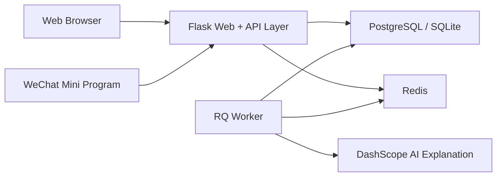

# Ti — 竞赛项目导览 / Competition Overview

> 面向中国大学生计算机设计大赛“软件应用与开发 - Web 应用与开发”的作品导览。  
> Competition-facing overview for the China College Computer Design Competition, Software Application & Development — Web Application track.

**完整文档 / Full documents**
- [中文完整版](README.zh-CN.md)
- [English Full Version](README.en.md)
- [开发文档](docs/DEVELOPMENT.md)
- [生产部署文档](docs/PRODUCTION.md)

## 中文摘要

Ti 是一个面向考试备考与题库运营场景的 **Flask 单仓全栈题库系统**。作品以 **Web 应用** 为参赛主体，覆盖公共题库、个人题库、刷题练习、模拟考试、学习数据、论坛互动与后台管理等核心流程；同时配套 **微信原生小程序** 作为移动端延展，两端共享同一套后端与数据语义。

## English Summary

Ti is a **single-repository full-stack question-bank platform built with Flask**. The competition entry is centered on the **Web application**, covering public banks, personal banks, practice workflows, mock exams, learning analytics, community interaction, and administration. A **native WeChat Mini Program** extends the same system to mobile scenarios while sharing one backend and one data model.

## 赛道适配 / Why This Fits the Web Application Track

- **Web 是主体交互端 / Web is the primary interface**：Web 端采用 Flask + Jinja 服务端渲染，承载题库广场、题库详情、数据中心、错题收藏、论坛与管理后台等核心能力。
- **不是展示站，而是完整业务系统 / Not a showcase site, but a working system**：仓库内已落地 12 个 Flask 业务模块，形成从内容管理到学习闭环的完整链路。
- **移动端是扩展而非替代 / Mobile is an extension, not a replacement**：微信小程序复用同一后端语义，用于补充高频移动学习场景。

## 核心亮点 / Key Highlights

- **单仓全栈 / Single-repo full stack**：Web、Mini Program、Flask 后端、数据库迁移与部署配置统一维护。
- **共享数据语义 / Shared backend semantics**：公共题库、个人题库、题目、收藏、错题、答案、进度、考试等能力在双端保持一致。
- **模块化 Flask 架构 / Modular Flask architecture**：应用工厂 + Blueprint 模块注册，已注册 `auth`、`main`、`quiz`、`exam`、`user_bank` 等 12 个业务模块。
- **双认证兼容 / Dual authentication model**：Web 使用 Session，小程序/API 使用 JWT，并兼顾 CSRF 与 Web XHR 校验链。
- **Docker 开发模式 / Dockerized development workflow**：默认开发编排包含 `web`、`worker`、`postgres`、`redis`、`backup` 五类服务。
- **统一接口信封 / Unified API envelope**：新接口遵循 `status / code / data / message` 响应结构，并提供 `/api/ping` 健康检查。

## 架构总览 / Architecture at a Glance



## 快速运行 / Quick Start

默认开发方式：

```bash
docker compose --env-file .env -f compose.dev.yml up
```

最小验证：
- Web：<http://localhost:8000>
- 健康检查：<http://localhost:8000/api/ping>
- 深度检查：<http://localhost:8000/api/ping?deep=1>

## 进一步阅读 / Read More

- [中文完整版：项目概述、功能模块、技术亮点、开发验证](README.zh-CN.md)
- [English full version: overview, features, architecture, validation](README.en.md)
- [Docker 开发说明](docs/DEVELOPMENT.md)
- [生产部署与备份](docs/PRODUCTION.md)
- [小程序 API 配置说明](miniprogram-1/README_API_CONFIG.md)
