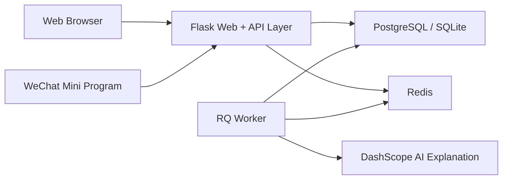

# Ti 题库系统（竞赛版说明）

> 面向中国大学生计算机设计大赛“软件应用与开发 - Web 应用与开发”的项目说明。  
> 根 README 请见：[README.md](README.md)；英文版请见：[README.en.md](README.en.md)。

## 1. 项目概述

Ti 是一个围绕考试备考、题库运营与学习数据分析场景构建的单仓库全栈系统。

项目事实与实现形态如下：

| 维度 | 说明 |
| --- | --- |
| 参赛主体 | **Web 应用**，基于 Flask + Jinja 模板 + 原生 JS/CSS |
| 移动端延展 | **微信原生小程序**，使用 TypeScript + Less，作为共享后端语义的移动端补充 |
| 后端架构 | Flask 应用工厂 + Blueprint 模块化拆分 |
| 数据与基础设施 | Docker 开发默认 PostgreSQL 16 + Redis 7 + RQ Worker |
| 统一接口风格 | `status / code / data / message` API 信封 |
| 认证模式 | Web 使用 Session，小程序/API 使用 JWT Bearer Token |
| 运行方式 | 默认基于 `compose.dev.yml` 的 Docker 开发模式 |

从仓库结构看，它不是前后端分离的多仓项目，也不是 SPA + 独立 API 服务的组合，而是一个以 Flask 为核心、同时支撑 Web 与小程序双端的完整业务系统。

## 2. 参赛定位与问题场景

本项目聚焦的是“题库内容管理 + 刷题学习闭环 + 数据反馈 + 运营支撑”的综合场景。传统备考工具常见的痛点包括：

- 公共题库与个人题库割裂，内容沉淀困难；
- 刷题、收藏、错题、进度、考试等学习数据分散；
- Web 管理端与移动学习端语义不一致，导致体验和数据同步成本高；
- 教学或运营方需要后台管理、公告通知、社区互动等支撑能力。

Ti 的参赛定位是：

1. 以 **Web 应用** 为核心承载完整业务流程，包括题库广场、题库详情、学习数据、论坛互动、运营管理等；
2. 以 **微信小程序** 承接移动学习与快捷访问场景，但不另起一套业务语义；
3. 通过单仓架构维持统一的数据模型、接口语义和部署方式。

因此，本项目符合“Web 应用与开发”赛道中“面向真实业务场景、具有完整前后端闭环、可运行可验证”的作品形态。

## 3. 核心功能

### 3.1 面向学习者的能力

| 能力域 | 已落地能力 | 关联模块 |
| --- | --- | --- |
| 公共题库 | 题库广场、题库详情、检索与分类浏览 | `main`、`quiz` |
| 个人题库 | 自建题库、加入题库、题库分享、公开题库 | `user_bank` |
| 刷题闭环 | 题目练习、答案记录、收藏、错题、学习进度、标签 | `quiz` |
| 模拟考试 | 考试创建、保存草稿、提交、结算、记录与模板 | `exam` |
| 学习反馈 | 数据中心、题库/科目统计、错题与收藏聚合 | `main`、`quiz`、`user` |
| AI 辅助 | 题目 AI 解析、异步任务处理 | `quiz`、`app/tasks` |

### 3.2 面向平台运营的能力

| 能力域 | 已落地能力 | 关联模块 |
| --- | --- | --- |
| 用户与资料 | 登录、绑定、个人资料、签到、账户设置 | `auth`、`user` |
| 通知与弹窗 | 系统通知、公告/弹窗管理 | `notifications`、`popups` |
| 社区互动 | 论坛发帖、评论、点赞、聊天消息 | `forum`、`chat` |
| 后台管理 | 用户、题目、科目、通知与系统配置管理 | `admin` |
| 编程题扩展 | 编程题与在线判题能力 | `coding` |

### 3.3 双端共享的数据语义

项目明确要求 Web 与小程序共享相同的数据语义，至少覆盖以下对象：

- 科目
- 公共题库
- 个人题库
- 题目
- 收藏 / 错题
- 用户答案 / 学习进度
- 模拟考试
- 通知 / 个人资料

这意味着，小程序不是一个“另做一套逻辑”的附属端，而是复用同一业务系统的移动入口。

## 4. 系统架构



### 4.1 Web 端

- Web 不是 SPA，而是 **Flask + Jinja 模板 + 原生 JS/CSS** 的服务端渲染架构；
- 公共壳层位于 `app/modules/main/templates/main/shared/app_shell.html`，集中处理布局、主题样式、深浅色模式与通用导航；
- 页面按业务模块拆分在 `app/modules/*/templates/` 下，配合 `static/css/` 与 `static/js/` 做渐进增强。

### 4.2 后端

- 核心入口为 `app/__init__.py` 中的 `create_app()`；
- 业务模块在 `app/modules/__init__.py` 中统一注册，当前共有 12 个已注册模块；
- 采用应用工厂、扩展初始化、统一错误处理、统一响应结构等基础设施模式。

### 4.3 小程序端

- 目录入口为 `miniprogram-1/miniprogram/`；
- `app.json` 中声明了主包页面与分包页面，当前共声明 58 个页面；
- 请求推荐统一走 `utils/api-endpoints.ts` + `utils/api-client.ts`，避免页面散写 `wx.request`。

### 4.4 数据与任务

- Docker 开发默认数据库为 PostgreSQL 16，配置见 `compose.dev.yml`；
- Redis 同时承担缓存、RQ 队列和限流存储；
- `worker` 容器通过 `rq worker -u $REDIS_URL $RQ_QUEUE_NAME` 处理后台任务；
- API 健康检查提供 `/api/ping` 与 `/api/ping?deep=1` 两个入口。

## 5. 技术亮点

### 5.1 单仓全栈与共享语义

项目将 Web、微信小程序、Flask 后端、数据库迁移和 Docker 部署保持在同一仓库内，降低了多仓协作和语义漂移的成本。对竞赛评审而言，这意味着作品具有清晰、可追踪、可复现的工程边界。

### 5.2 Web 主体 + 小程序扩展的双端协同

项目将 Web 定位为主业务承载端，小程序定位为移动延展端，但二者共用同一后端和数据语义。这样的设计既符合 Web 应用赛道定位，又兼顾了移动场景下的实际使用需求。

### 5.3 模块化 Flask 架构

后端采用应用工厂与 Blueprint 模块注册模式，业务被拆分为 `auth`、`main`、`quiz`、`exam`、`user_bank`、`forum`、`admin` 等模块，便于按领域维护和扩展。

### 5.4 双认证与接口兼容策略

- Web：Session 为主；
- 小程序/API：JWT Bearer Token 为主；
- Web XHR 写请求还需兼顾 `X-Requested-With` 与 CSRF 校验链；
- API 响应逐步统一为 `status / code / data / message`，兼顾新旧客户端兼容。

### 5.5 Docker 化开发与部署链路

仓库为本机开发提供 `compose.dev.yml`，标准编排包含 `web`、`worker`、`postgres`、`redis`、`backup` 服务；生产环境则通过 `compose.prod.yml`、Gunicorn 与 Nginx 组合部署。对竞赛作品而言，这提升了演示与复现的稳定性。

### 5.6 面向真实业务的可验证性

项目不仅提供页面功能，也提供可直接验证的工程证据：

- 健康检查接口：`/api/ping`、`/api/ping?deep=1`；
- Docker 运行入口：`compose.dev.yml`；
- 自动化冒烟测试：`tests/test_smoke_health.py`、`tests/test_smoke_auth.py`、`tests/test_smoke_api.py`。

## 6. 仓库结构

```text
.
├── app/                         # Flask 应用与业务模块
│   ├── __init__.py              # create_app() 应用工厂
│   ├── core/                    # 配置、扩展、错误处理、工具
│   ├── models/                  # ORM 模型
│   ├── modules/                 # 12 个业务模块
│   └── tasks/                   # 后台任务
├── miniprogram-1/               # 微信小程序工程
│   └── miniprogram/
│       ├── pages/               # 主包页面
│       ├── packages/            # 分包页面
│       ├── components/          # 组件
│       └── utils/               # API 与工具层
├── static/                      # Web 静态资源
├── templates/                   # 全局模板目录
├── migrations/                  # Alembic 迁移脚本
├── docker/                      # Dockerfile 等镜像资源
├── compose.dev.yml              # Docker 开发编排
├── compose.prod.yml             # Docker 生产编排
├── docs/                        # 开发、部署、迁移等补充文档
└── tests/                       # pytest 冒烟测试
```

## 7. Docker 开发与验证

### 7.1 默认开发方式

```bash
cp .env.example .env
# 按需补充 WECHAT_APPID / WECHAT_SECRET / DASHSCOPE_API_KEY 等配置

docker compose --env-file .env -f compose.dev.yml up
```

开发编排的事实配置：

- `web`：`flask run --host 0.0.0.0 --port 8000 --reload`
- `worker`：`rq worker -u $REDIS_URL $RQ_QUEUE_NAME`
- `postgres`：默认映射 `5432:5432`
- `redis`：为缓存、限流与队列提供统一存储
- `backup`：提供开发环境下的定时备份能力

### 7.2 初始化数据库

```bash
docker compose --env-file .env -f compose.dev.yml exec web flask db upgrade
```

### 7.3 最小运行验证

```bash
# 健康检查
curl http://localhost:8000/api/ping
curl http://localhost:8000/api/ping?deep=1
```

浏览器访问：<http://localhost:8000>

### 7.4 小程序联调说明

- 使用微信开发者工具打开 `miniprogram-1/`；
- 小程序 API 模式由 `miniprogram-1/miniprogram/utils/config.ts` 控制，支持 `prod` 与 `custom` 两种显式模式；
- API 配置细节见：[miniprogram-1/README_API_CONFIG.md](miniprogram-1/README_API_CONFIG.md)。

## 8. 测试与质量

当前仓库已包含面向关键路径的 pytest 冒烟测试：

```bash
pytest
```

已覆盖的验证方向包括：

- 健康检查接口是否可达；
- 登录接口的基本成功/失败路径；
- 关键页面与 API 的认证保护和可访问性。

对应测试文件：

- `tests/test_smoke_health.py`
- `tests/test_smoke_auth.py`
- `tests/test_smoke_api.py`

除此之外，项目还在工程层面引入了以下质量保障机制：

- 全局错误处理与统一响应结构；
- 基于 Redis 的限流存储能力；
- 日志系统与敏感信息脱敏；
- 生产环境可接入 Sentry 监控。

> 注：此处仅陈述仓库中已存在的测试与质量机制，不夸大覆盖率或线上效果。

## 9. 扩展说明

### 9.1 小程序扩展

本项目虽然以 Web 作为参赛主体，但小程序并非演示壳层，而是共享同一套后端语义的原生移动端延展。相关事实源文件包括：

- `miniprogram-1/miniprogram/app.json`
- `miniprogram-1/miniprogram/utils/config.ts`
- `miniprogram-1/miniprogram/utils/api-client.ts`
- `miniprogram-1/miniprogram/utils/api-endpoints.ts`

### 9.2 AI 能力

题目 AI 解析接入阿里云 DashScope OpenAI 兼容接口，配置项包括：

- `DASHSCOPE_API_KEY`
- `DASHSCOPE_BASE_URL`
- `DASHSCOPE_MODEL`
- `DASHSCOPE_TIMEOUT`

### 9.3 补充文档

- 开发环境说明：[docs/DEVELOPMENT.md](docs/DEVELOPMENT.md)
- 生产部署说明：[docs/PRODUCTION.md](docs/PRODUCTION.md)
- Docker 命令速查：[docs/Docker命令速查.md](docs/Docker命令速查.md)
- 双机同步说明：[docs/Mac-Windows双机开发同步教程.md](docs/Mac-Windows双机开发同步教程.md)

---

如需面向答辩继续补充“项目截图、典型流程、演示脚本、成员分工、答辩要点”等材料，可以在此基础上继续扩展展示版文档。
