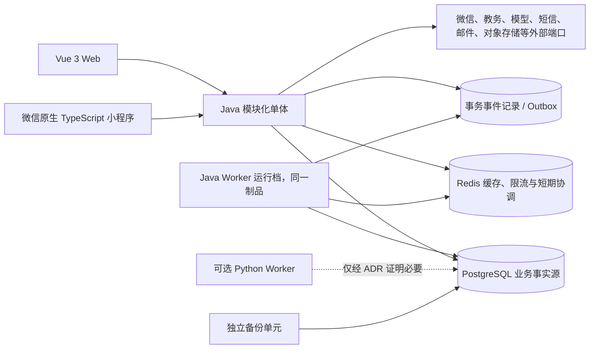
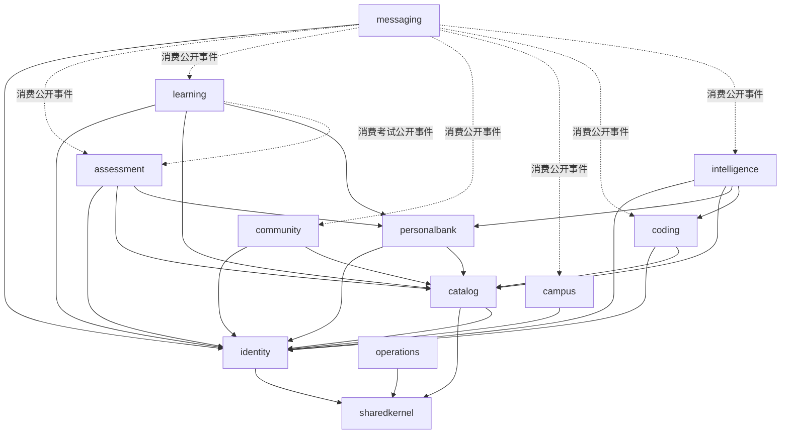

# Ti-Java 目标架构

## 1. 文档状态

- 状态：阶段 1 架构决策已接受；实现必须遵守 ADR、机器合同和契约门禁。
- 依据：`00-current-state.md`、`02-route-parity-matrix.csv`、`03-data-ownership.csv`、`phase1/module-contracts.json`、`phase1/business-invariants.json` 与 `adr/`。
- 阶段 1 已把候选边界固化为 11 个业务模块、一个 Web 适配边界和无环依赖合同；后续不得用实现便利绕过公开 API、唯一所有权或单写者约束。
- 路由、资源和契约仍按迁移矩阵逐项推进；“架构已接受”不表示任何旧路由、数据写所有权或生产流量已经迁入 Java。

## 2. 架构目标与明确非目标

目标是一个可从 `Ti-Java/` 独立抽取的领域模块化单体：Java 25、Spring Boot 4.1、Spring MVC、Spring Modulith、PostgreSQL、Redis，以及独立的 Vue Web 和微信原生 TypeScript 小程序。核心收益是稳定契约、明确事务所有权、可验证模块边界和可恢复迁移，而不是把旧 Flask 代码逐文件翻译成 Java。

本轮不以以下内容为目标：

- 不把业务提前拆成微服务，不引入 Kubernetes、Kafka、服务注册中心或分布式事务。
- 不以 WebFlux 包装 JPA、JDBC 等阻塞调用。
- 不建立全局 `controller/service/repository/model` 技术层目录。
- 不让新项目在运行时调用旧 Flask、读取父目录文件或挂载旧项目目录。
- 不让 Redis、队列或文件系统替代 PostgreSQL 成为业务最终事实源。
- 不在功能迁移同时进行全站视觉重设计。

## 3. 上下文与部署单元



初期允许的部署单元保持少量且职责清晰：

| 部署单元 | 职责 | 约束 |
| --- | --- | --- |
| `server-api` | HTTP、SSE、短事务、健康检查 | 一个 Spring Boot 制品；不执行长时间阻塞任务 |
| `server-worker` | Outbox 消费、导入导出、通知等后台命令 | 默认与 API 使用同一 Java 制品和不同运行 Profile，避免过早拆服务 |
| `web` | Vue 静态资源及入口网关 | API 类型只来自 OpenAPI 生成客户端 |
| `miniprogram` | 微信客户端制品 | 保持兼容路径，独立构建，不读取旧小程序 |
| `postgres` | 唯一业务事实源 | Java 使用 Flyway；Hibernate 只做 `validate` |
| `redis` | 可重建缓存、限流、会话辅助、短期锁/协调 | 不保存不可恢复的最终结果 |
| `backup` | PostgreSQL 与持久文件的备份、校验、恢复 | 独立于旧 Sidecar，先完成恢复演练 |
| `ai-worker`（可选） | Python 专属数据流水线或需资源隔离的推理 | 只有性能/依赖证据和 ADR 批准后才创建 |

本地并行验证时，旧 Flask 与新 Java 可以同时运行，但必须使用不同端口、数据库、Redis、卷和运行身份。生产最终切换是整个部署单元切换，不按路由将两个后端拼接在同一运行链路中。

## 4. 模块内部结构

Java Server 首先保持一个 Maven 应用模块，使用 Java package 和 Spring Modulith 表达业务模块：

```text
io.saksk.ti
├── sharedkernel/          # 稳定 ID、时间、分页、错误信封等极小基础类型
├── identity/
├── catalog/
├── personalbank/
├── learning/
├── assessment/
├── community/
├── messaging/
├── campus/
├── coding/
├── intelligence/
└── operations/
```

每个业务模块按实际复杂度使用以下轻量六边形结构；简单 CRUD 不创建空壳层：

```text
<module>/
├── api/                   # HTTP 适配器、公开 DTO、公开应用 API
├── application/           # 命令/查询用例、事务编排、端口
├── domain/                # 聚合、值对象、不变量、领域事件
└── infrastructure/        # JPA、Redis、外部客户端和框架适配器
```

包可见性和 Modulith 验证共同执行以下规则：

1. 其他模块只能引用目标模块显式公开的应用 API、DTO 和事件。
2. JPA Entity、Repository 和基础设施实现均为模块内部实现。
3. 跨模块只保存稳定 ID，不建立跨模块共享实体对象图。
4. 同步调用只用于当前请求必须得到的结果；邮件、短信、未读更新、审计等后续动作优先由可靠事件驱动。
5. `sharedkernel` 只容纳稳定、无业务所有权的类型；不能演变成通用服务或工具垃圾场。

## 5. 领域边界

| 模块 | 拥有的业务能力 | 公开能力示例 | 不应拥有 |
| --- | --- | --- | --- |
| `identity` | 用户、角色、凭据、Session/JWT、微信绑定、账号安全 | 当前身份解析、用户/角色查询、会话失效命令、账号事件 | 业务题库权限、论坛关注、教务凭据 |
| `catalog` | 科目、公共题库、公共题目元数据、可见性与展示 | 题目/题库只读查询、可见性判定、目录变更事件 | 用户练习状态、个人题库、考试答卷 |
| `personalbank` | 个人题库、个人题目、导入导出、所有权 | 个人题目查询、导入命令、所有权判定 | 公共题库元数据、练习统计 |
| `assessment` | 考试、试卷、作答、提交、评分、结果 | 开始/作答/交卷、结果查询、考试完成事件 | 日常练习统计、消息发送 |
| `learning` | 练习、答案、错题、收藏、复习、学习记录与统计 | 练习命令、学习查询、幂等答案写入 | 试卷评分、题目主数据 |
| `community` | 版块、帖子、评论、关注、互动事实 | 发帖/评论/关注、内容查询、互动事件 | 私聊投递、通知未读缓存 |
| `campus` | 教务账号、加密凭据、课表、成绩、快照和查询任务 | 绑定/查询命令、最近成功快照、刷新事件 | 通用身份凭据、通知渠道 |
| `coding` | 编程题、测试用例元数据、提交与判题状态 | 题目查询、提交命令、判题完成事件 | 通用模型会话、系统备份 |
| `intelligence` | AI 对话、题目解析、提示词策略、模型调用记录 | 对话/解析命令、调用状态与完成事件 | 通用 HTTP 客户端、计费事实外的支付状态 |
| `messaging` | 私聊、通知、未读计数、SSE 兼容事件 | 消息/通知命令、未读查询、用户事件流 | 论坛互动事实、考试结果事实 |
| `operations` | 平台配置、平台弹窗、审计、备份记录、支付状态和平台级运维 | 受限设置查询、备份/审计命令、平台状态 | 其他模块实体的后台 CRUD |

“后台页面”不是一个天然业务所有权。用户管理归 `identity`，题库管理归 `catalog`/`personalbank`，论坛管理归 `community`；相应管理 HTTP 适配器应位于数据所有模块。`operations` 只拥有平台级能力。阶段 1 应据此复核当前矩阵中初步归为 `operations` 的后台路由，防止形成全能后台模块和依赖环。

## 6. 目标依赖 DAG

下图是阶段 1 已接受的业务依赖方向；事件消费者只依赖生产者公开事件，禁止反向同步回调。为保持图可读，除已画出的 `identity`/`operations` 外，其余模块到 `sharedkernel` 的重复直接边以及 Web 对 11 个业务公开 API 的扇出未展开；精确允许边以 `phase1/module-contracts.json` 和 ADR-0010 为机器权威。



图中及机器合同未列出的依赖默认禁止。`catalog → identity` 是阶段 1 根据科目权限真实代码新增的窄只读边；`messaging` 对六个领域的边只能异步消费公开事件。`operations` 不反向调用所有领域来实现集中式后台，Web 不拥有表或 JPA 持久化。

`validate_phase1_boundaries.py` 已证明合同无环、154 类资源唯一归属且无共享 JPA Entity。阶段 2 必须把同一允许边落实为 Modulith `allowedDependencies`、Named Interface 与架构测试；若真实事务要求新方向，应先更新机器合同和 ADR，再改实现，不能用内部类、反射或字符串事件绕过检查。

## 7. 数据与事务

- PostgreSQL 是业务事实源；每张表只能由一个模块写入。
- 同一用例内的聚合变更和待发布事件在一个本地数据库事务提交。
- 跨模块不共享数据库会话来修改对方表；需要立即结果时调用公开应用 API，需要后续动作时使用领域事件。
- 可靠发布采用 ADR-0009 已接受的 Spring Modulith JDBC Event Publication Registry；业务事实、幂等记录和 publication 在同一本地事务提交，消费者仍必须支持稳定幂等键、重试、失败观察和人工处置。
- Redis 数据必须可从 PostgreSQL 或确定性计算重建。缓存失效由拥有事实的模块发出事件，缓存适配器负责执行。
- Flyway 正式 baseline 只在阶段 8 建立，并记录旧 Alembic head `f5b6c7d8e9f0` 的对应关系；此前禁止伪造 baseline。
- Hibernate 在所有非测试运行档使用 `ddl-auto=validate` 或等价只校验模式。

## 8. API、认证与客户端

兼容层首先复现矩阵记录的旧路径、方法、状态码、信封、分页、空值、鉴权和错误语义。新设计可以规划 `/api/v1`，但在 Web 和小程序都迁移并通过之前，旧路径由 Java 内部兼容 Controller 直接实现，不能代理旧 Flask。

- OpenAPI 3.1.2 是 Java HTTP 契约和 Vue TypeScript 客户端的唯一类型来源；阶段 1 初稿位于 `../../contracts/openapi.json`。
- Web 目标认证为安全 Cookie；小程序使用短期 Access Token、可撤销/轮换 Refresh Token，并兼容现有 `session_version` 语义。
- 旧密码哈希、角色、微信绑定和会话失效语义由 Java 本地实现兼容，不使用旧 Flask introspection。
- SSE 作为 `messaging` 的输出适配器保留兼容；PostgreSQL 中的消息和通知事实不能依赖连接是否在线。
- 时间、金额/分数精度、枚举、分页、空值和错误信封已由 ADR-0006 与 `phase1/api-contract-conventions.md` 固定；旧兼容 operation 仍以逐项观测行为为准。

## 9. 外部集成和 Python 边界

微信、教务、模型、短信、邮件、支付和对象存储均以消费模块定义的端口接入，适配器记录 Request ID、供应方、耗时和安全摘要，不记录密钥或完整敏感载荷。普通 OpenAI 兼容 HTTP 调用属于 `intelligence` 的 Java 适配器；邮件、短信也不因异步执行而自动拆成 Python 服务。

只有以下证据成立并经 ADR 批准，才创建 `services/ai-worker/`：

1. 依赖 Pandas、NumPy、文档解析等 Python 专属生态；或
2. 需要单独 CPU/内存隔离的代码执行、模型推理、大型导入导出；或
3. Java 无法以同等可靠性和维护成本完成，且有可复现测量。

## 10. 架构验证

后续实现至少提供以下自动化门槛：

- Spring Modulith `ApplicationModules.verify()` 检查无循环依赖和公开包边界。
- ArchUnit/编译测试禁止跨模块引用 `infrastructure`、Repository 和 Entity。
- Testcontainers 验证 PostgreSQL、Redis、Flyway 与事务事件。
- 契约测试逐行关联 `02-route-parity-matrix.csv`，不允许静默遗漏。
- 数据所有权测试保证 `03-data-ownership.csv` 中每个资源恰有一个所有者。
- 从只含 `Ti-Java/` 的临时目录执行构建、测试与启动，检测父目录依赖。

## 11. ADR 索引（阶段 1 已接受）

下列 ADR 均于 2026-07-16 接受；后续实现与决策不一致时必须先修订对应 ADR 并重新运行阶段门禁：

| ADR | 主题 | 已接受方向 | 状态 |
| --- | --- | --- | --- |
| [`adr/0001-java-25-and-spring-boot.md`](adr/0001-java-25-and-spring-boot.md) | Java、Spring Boot、Modulith 精确版本 | Java 25、Boot 4.1.0、Modulith 2.1.0、Maven Wrapper 3.9.16 | 已接受 |
| [`adr/0002-modular-monolith.md`](adr/0002-modular-monolith.md) | 模块化单体与轻量六边形边界 | 单 Maven 应用、package 模块、唯一资源所有者 | 已接受 |
| [`adr/0003-spring-mvc.md`](adr/0003-spring-mvc.md) | MVC 与阻塞数据访问 | Spring MVC，不使用 WebFlux 包装 JPA | 已接受 |
| [`adr/0004-database-coexistence.md`](adr/0004-database-coexistence.md) | 新旧数据库并行、单写者与 Flyway | 独立双库验证，最终停写整体切换 | 已接受 |
| [`adr/0005-authentication-transition.md`](adr/0005-authentication-transition.md) | Session/JWT/密码哈希/微信兼容 | Java 本地限时兼容，最终 Web Cookie + 小程序令牌 | 已接受 |
| [`adr/0006-api-contract.md`](adr/0006-api-contract.md) | 信封、错误、分页、时间和精度 | OpenAPI 3.1.2 + 旧路径兼容 Controller | 已接受 |
| [`adr/0007-vue-web-migration.md`](adr/0007-vue-web-migration.md) | Vue SPA、公开页面 SEO 与客户端生成 | 垂直等价迁移；有量化证据后再决定预渲染/Nuxt | 已接受 |
| [`adr/0008-python-worker-boundary.md`](adr/0008-python-worker-boundary.md) | Python 保留条件 | 默认 Java；证据充分且隔离后才创建 Python Worker | 已接受 |
| [`adr/0009-reliable-events.md`](adr/0009-reliable-events.md) | 可靠事件与后台命令 | PostgreSQL 持久化的 Modulith JDBC Publication Registry | 已接受 |
| [`adr/0010-module-dependency-dag.md`](adr/0010-module-dependency-dag.md) | 模块公开 API、事件与依赖方向 | 机器合同定义 11 个业务模块、Web 边界和无环允许边 | 已接受 |

每份 ADR 已记录上下文、决定、后果、拒绝方案和验证证据。遇到真实代码事实推翻已接受方向时，应明确修订状态、机器合同和迁移矩阵，不能悄悄让实现漂移。
