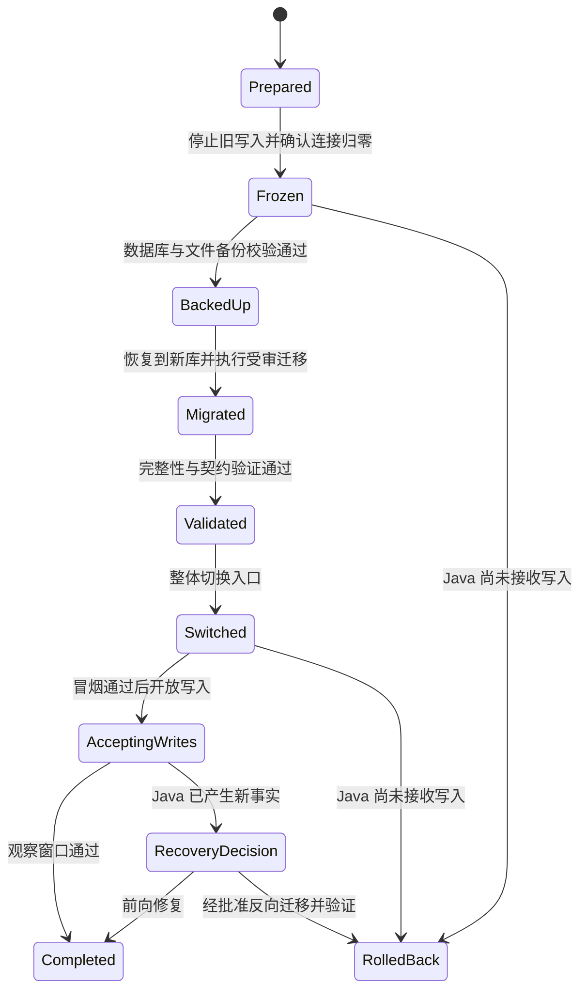

# Ti-Java 并行验证、整体切换与回滚手册

## 1. 状态与安全边界

本文是阶段 0 运行手册基线，用于约束后续工具和演练。它不是生产变更授权，也不表示切换脚本、Flyway baseline 或新 Java 运行时已经完成。

当前任务明确禁止：

- 连接或修改真实生产数据库、服务器、DNS、网关和对象存储；
- 读取、复制或输出真实密钥；
- 在生产执行本文命令模板；
- 让 Flask 与 Java 同时写同一个数据库；
- 将影子流量、逐路由代理或双写作为迁移方案。

阶段 0 和后续无额外授权的演练只能使用本地夹具或经过授权且脱敏的备份副本。涉及生产的步骤必须在未来取得当前变更窗口的明确授权、完成阶段 10 前置门槛并由责任人复核后才能执行。

## 2. 不变量与环境拓扑

迁移全过程必须满足“单写者（single writer）”原则：

> 任意时刻，每张表、每类写命令只有一个运行时写入者。

本地/测试并行拓扑如下：

| 环境 | 后端 | PostgreSQL | Redis/队列 | 持久文件 | 写权限 |
| --- | --- | --- | --- | --- | --- |
| `legacy-read` | 旧 Flask | `legacy_read_db` | `legacy_read_redis` | 脱敏只读副本 | 禁止业务写 |
| `java-read` | 新 Java | `java_read_db` | `java_read_redis` | 独立脱敏只读副本 | 禁止业务写 |
| `legacy-write` | 旧 Flask | `legacy_write_db` | `legacy_write_redis` | `legacy-write` 独立卷 | 只写自己的库 |
| `java-write` | 新 Java | `java_write_db` | `java_write_redis` | `java-write` 独立卷 | 只写自己的库 |

四套数据库都从同一个标记清晰的脱敏基础快照恢复，但容器名、网络、端口、数据库用户、卷和 Secret 必须独立。比较工具只在测试网络中运行，不能进入新项目生产依赖。

建议所有证据写入一次性运行目录：

```text
artifacts/migration/<run-id>/
├── manifest.json              # 提交、镜像 digest、快照校验和、环境与时间
├── requests/                  # 脱敏输入
├── read-diffs/                # HTTP 结构化差异
├── before/                    # 写比较前数据库摘要
├── legacy-after/              # 旧实现写后摘要
├── java-after/                # Java 写后摘要
└── validation/                # 行数、约束、聚合、文件引用和性能证据
```

`artifacts/` 必须被忽略且不得包含 Secret。需要长期保存的脱敏小样本才经人工检查后进入 `docs/refactor/golden-samples/`。

## 3. 迁移状态机与闸门



每个状态都有书面进入证据和唯一负责人。任一闸门失败即停止推进；不得跳过校验，也不得为了缩短维护窗口同时开放新旧写入。

## 4. 只读请求对比

### 4.1 前置条件

1. 从同一脱敏快照分别恢复 `legacy_read_db` 和 `java_read_db`。
2. 两个运行时使用独立 Redis，并清空非确定性缓存；记录冷/暖缓存状态。
3. 固定时区、Locale、当前时间、外部 API stub 和测试用户身份。
4. 禁止定时任务、RQ/Worker、邮件、短信、支付回调及其他副作用。
5. 验证数据库用户只有 `SELECT` 权限；健康检查不得隐式执行迁移或建表。
6. 请求集合来自黄金样本、现有测试、页面调用和 `02-route-parity-matrix.csv`，每条请求关联唯一 `route_id`。

### 4.2 执行与比较

对旧 Flask 和新 Java 分别发送相同请求，保存原始脱敏响应和规范化响应。只允许规范化明确的易变字段，如 Request ID、服务器时间和已记录为非契约的追踪信息；不得忽略排序、分页、空值或业务字段。

逐项比较：

- HTTP 状态码、Content-Type、下载文件名及缓存 Header；
- 响应信封、字段类型、缺失字段与 `null` 的区别；
- 列表排序、分页边界、总数、默认值和枚举；
- 未登录、过期身份、权限不足、资源不存在和限流错误；
- 时间格式/时区、分数/金额精度和舍入；
- SQL 数量、响应时间和非预期外部调用。

差异只能标为以下三类：`legacy-baseline`（已知旧问题）、`java-regression`（必须修复）或 `approved-difference`（必须关联已接受 ADR）。没有分类和证据的差异不能放行。

### 4.3 只读放行条件

- 本批矩阵路由全部执行，不能用抽样代替覆盖率结论；
- 状态码、信封和关键字段完全相等；
- 批准差异均有 ADR、客户端兼容分析和回退方案；
- 任何查询不得改变数据库、Redis 业务状态或持久文件；
- 性能数据记录样本数、并发、缓存状态和数据规模，核心 p95 不比基线恶化超过 20%，或已有经批准的正确性收益说明。

## 5. 写请求双快照对比

写对比不是双写。它是在两个相互隔离、来源相同的快照上分别执行同一业务命令，再比较最终事实。

### 5.1 准备

1. 生成一个脱敏、静止的基础备份，记录 SHA-256、Alembic head、表行数和持久文件清单。
2. 从该备份恢复两个新数据库：`legacy_write_db` 与 `java_write_db`。
3. 为两边分配不同数据库角色、Redis、对象卷、外部服务 stub 和端口。
4. 固定时钟、随机种子、业务 ID/幂等键；无法固定的 ID 建立一一映射，不能直接忽略。
5. 保存写前快照：行数、主键范围、关键表规范化导出、序列、文件清单、任务/Outbox 状态。
6. 确认旧运行时只能访问 `legacy_write_db`，Java 只能访问 `java_write_db`；用连接审计验证而非仅相信配置文件。

### 5.2 执行

- 对旧实现执行一次脱敏业务命令并等待其本地后台动作达到确定终态。
- 在另一个隔离环境对 Java 执行同一命令、相同幂等键与等价身份。
- 重放重复请求、并发请求、超时重试和失败注入，验证幂等与事务回滚。
- 不转发旧写请求给 Java，不让一个环境消费另一个环境的队列，也不复制执行中的增量数据。

重点旅程至少覆盖：登录/绑定、加入与维护题库、答案/收藏/错题、考试交卷评分、帖子/评论/关注、消息/通知、教务刷新、编程提交、AI 任务和后台配置。

### 5.3 最终状态比较

每个用例比较：

- HTTP 契约和错误语义；
- 受影响表的新增、修改、删除集合；
- 外键、唯一约束、主键/业务 ID、版本号和序列；
- 分数、统计、未读数、任务状态、重试次数和幂等记录；
- Outbox/事件数量、事件类型与消费者终态；
- 文件内容哈希、对象 Key、引用关系和临时文件清理；
- 失败用例后的零部分写入或预期补偿结果。

禁止仅比较 HTTP 200 或表行数。所有允许的状态差异必须有业务规则说明和 ADR；考试评分等要求零差异的领域不得用容差掩盖错误。

### 5.4 重置

一个测试批次结束后销毁两套写库、Redis 和卷，再从基础备份恢复。不得把上次残留状态作为下次输入，也不得用清表代替可验证恢复。

## 6. 最终切换前置门槛

以下条件全部满足后，才能申请生产变更授权：

- `02-route-parity-matrix.csv` 无 `pending`、`unknown` 或未批准差异；
- `03-data-ownership.csv` 中每张表、Redis Key、文件前缀和任务有唯一目标所有者；
- Java、Web、小程序、契约、E2E、安全、Compose、性能和恢复测试全部通过；
- Flyway baseline 已在独立脱敏恢复库演练并与 Alembic head 建立对应；
- 备份恢复、前向迁移和回滚演练均有最近绿色证据；
- 旧 RQ 不再接受新任务，存量任务已完成、安全接管或明确失败；
- 新生产配置不包含旧 Flask upstream、父目录挂载、影子请求或 introspection；
- 已确认维护窗口、负责人、观察窗口、回滚阈值、通信渠道和批准人；
- 已检查从最后一次演练以来的 schema、代码、数据规模和外部接口漂移。

## 7. 最终停写、备份、迁移和整体切换

本节是未来获批窗口的操作顺序模板。阶段 0 不执行。

### 7.1 准备（`Prepared`）

1. 固定旧/新提交、镜像 digest、配置版本和数据库迁移版本。
2. 运行窗口前只读预检，确认磁盘、连接数、复制/备份空间、证书和第三方连通性。
3. 准备维护页；禁止新登录、写请求、Webhook、定时任务和队列生产者进入。
4. 记录核心表行数、主键范围、聚合统计、文件对象数、RQ 长度、定时任务和最后成功备份。
5. 为新项目准备全新的目标数据库、Redis 和持久卷；不得原地把正在服务的旧库交给 Java 改造。

### 7.2 停止旧写入（`Frozen`）

严格按顺序：

1. 入口切换到维护模式，拒绝所有外部写请求和回调。
2. 停止旧定时任务和新 RQ 入队。
3. 等待允许完成的请求和任务结束；不能安全完成的任务记录状态与幂等键后停止。
4. 停止旧 Web、Worker、backup scheduler 以外所有可能写入者。
5. 撤销旧应用数据库角色的写权限或隔离网络，确认活跃写事务和应用连接为零。
6. 记录冻结时间、最后业务 ID/时间戳、队列状态和数据库 LSN/等价一致性位置。

只有数据库审计证明没有写入者，才能进入备份。维护页本身不得访问业务数据库执行写操作。

### 7.3 备份（`BackedUp`）

1. 创建一致性 PostgreSQL 全量备份，并保存 schema、扩展、角色需求、序列和迁移版本。
2. 备份上传文件/对象、加密元数据和必要的配置密文；不把 Secret 写入日志或工件。
3. 导出 RQ/任务清单用于核对；Redis 不是事实备份，不能以 Redis 快照替代 PostgreSQL。
4. 为每个归档计算校验和，记录大小、创建时间、工具版本、加密方式和恢复命令。
5. 在隔离位置实际恢复一次并通过最小校验。只有“可恢复”的备份才算完成。

备份文件名、命令和存储位置由阶段 8/9 的受审脚本生成；不得临场手写带真实凭据的命令。

### 7.4 迁移到新库（`Migrated`）

1. 将冻结备份恢复到全新的目标 PostgreSQL，旧源库保持只读且不改动。
2. 校验旧 Alembic head 与受审 Flyway baseline 的对应关系。
3. 使用固定的新 Java 制品执行 Flyway `validate`/`migrate`；禁止 Hibernate 自动 DDL。
4. 迁移持久文件/对象并核对哈希和数据库引用。
5. 将可安全接管的任务按稳定幂等键导入 Java 任务/Outbox；其余任务明确标记完成、取消或失败，不能遗失在旧 Redis。
6. Java、Worker 和 Web 先在未对外网络启动，只允许健康检查和受控验证，不开放业务写入。

### 7.5 数据与契约校验（`Validated`）

必须自动生成并人工复核至少以下报告：

| 类别 | 校验 |
| --- | --- |
| 结构 | Flyway 版本、表/列/类型、主外键、唯一约束、索引、扩展、序列 |
| 完整性 | 核心表行数、主键范围、外键孤儿、重复唯一键、非空违规 |
| 业务聚合 | 用户/题库/题目、学习统计、考试与分数、帖子评论、消息通知、课表成绩、任务状态 |
| 身份 | 密码哈希可验证、角色、`session_version`、微信绑定、加密教务凭据抽样解密 |
| 文件 | 对象数量、内容哈希、数据库引用、缺失/孤立对象 |
| 异步 | 旧 RQ 清单、Java Outbox/任务状态、幂等键、无无人处理任务 |
| 契约 | 黄金样本、公开 GET、登录、关键写旅程、Web/小程序冒烟 |
| 运行 | readiness/liveness、数据库/Redis、日志脱敏、Request ID、资源和 p95 |

任一关键差异未解释即回到维护状态处理，不得带病开放流量。

### 7.6 整体切换（`Switched` → `AcceptingWrites`）

1. 保持旧 Flask、旧 Worker 和旧数据库写角色禁用。
2. 一次性把入口从旧部署切到 Java API + Vue Web；兼容 API 由 Java 提供，不做逐路由流量拆分。
3. 小程序继续使用已验证的兼容路径；客户端发布不是允许回退旧 Flask 的理由。
4. 在入口仍限制写入时运行健康、身份、公共题库和关键只读冒烟。
5. 冒烟全绿后，由唯一负责人解除 Java 写限制，记录“新写入纪元”的开始时间和首个业务 ID。
6. 运行关键写入冒烟并验证数据库、Outbox、Worker、SSE 和客户端结果。
7. 在约定观察窗口持续看错误率、登录失败率、p95、连接池、队列积压、业务聚合和外部调用。

旧源库和部署在回滚保留期内保持隔离、只读和可审计；不得作为隐藏的在线回退接口。

## 8. 回滚

### 8.1 触发条件

窗口前必须写入具体阈值，至少涵盖：

- readiness/liveness 持续失败；
- 登录/权限或小程序关键旅程大面积失败；
- 数据完整性、评分、统计或文件引用出现未解释差异；
- 错误率、p95、连接池或队列积压超过批准阈值；
- 密钥解密、外部回调、Outbox/任务可靠性不满足门槛；
- 发现旧与新同时写入或新项目访问旧运行时。

### 8.2 Java 尚未接收业务写入

这是低风险回滚路径：

1. 保持维护模式，停止 Java API/Worker。
2. 保存日志、校验报告和目标库快照作为事故证据。
3. 确认旧源库自冻结后没有被修改，恢复旧数据库角色和旧部署。
4. 对旧部署运行健康与关键只读冒烟。
5. 整体把入口切回旧部署，再解除维护模式。
6. 记录失败阶段、根因和下次演练要求。

### 8.3 Java 已接收业务写入

禁止直接把入口指回冻结时刻的旧库，否则会静默丢失切换后的用户数据。此时先重新冻结：

1. 入口进入维护模式，停止 Java 新写入、Worker 和任务生产者，确认连接归零。
2. 备份 Java 当前数据库、文件和任务状态，记录新写入纪元的范围。
3. 由变更负责人在以下路径中明确选择并批准：
   - **前向修复**：在当前 Java 数据上修复制品/配置，完整校验后重新开放；默认优先。
   - **反向迁移**：从冻结备份建立新的回滚库，把 Java 窗口内增量按受审脚本转换进去，再校验旧 Flask 可读写。
   - **恢复冻结备份**：只有业务负责人明确接受并记录窗口内数据丢失，且无可行前向/反向路径时才能选择。
4. 反向迁移必须在第三套隔离数据库完成；旧 Flask 与 Java 仍不得同时写。
5. 对回滚库执行与第 7.5 节等价的完整性、身份、文件、任务和契约校验。
6. 停止 Java，启动旧部署并仅连接已验证的回滚库，整体切换入口后再开放写入。

如果 Flyway 变化保持向前兼容，也不能未经演练就让旧 Flask 直接连接 Java 目标库。任何破坏性 schema 变更在旧运行方退出并完成恢复演练前均禁止执行。

## 9. 备份与数据验证清单

每次演练和获批切换都应形成可机器读取的清单：

- 源/目标提交、镜像 digest、Alembic/Flyway 版本；
- 快照 ID、校验和、数据库大小、持久文件数量与总大小；
- 69 张基线业务/支持表及后续新增表的行数、主键范围和所有者；
- 关键外键孤儿查询、唯一键重复查询和序列落后检查；
- 用户认证、题库/题目、答案/统计、考试评分、社区/消息、教务快照、编程/AI、后台配置的聚合摘要；
- Redis 可重建证明，RQ/Outbox/任务处置明细；
- 黄金请求和关键写旅程结果；
- 差异、批准 ADR、负责人、时间和最终处置。

密码、令牌、Cookie、教务凭据、第三方 Secret 和完整敏感提示词不得出现在报告中。身份兼容使用“可验证/不可验证”和脱敏 ID 表达。

## 10. 演练频率与证据保留

- 每个领域迁移完成后运行对应只读与写双快照对比。
- schema、认证、队列或文件迁移改变后重新做完整恢复/回滚演练。
- 最终窗口前使用与目标版本相同的制品和同量级脱敏数据完成一次全流程演练。
- 失败演练保留完整错误、最小复现和分类；同一路径连续失败三次后记录并改用安全替代方案。
- `05-progress.md` 记录最近绿色提交、命令和工件摘要；大体积/敏感工件不提交 Git。

## 11. 当前阶段可执行范围

阶段 0 目前只允许复核文档、运行旧系统只读基线、在临时 SQLite/本地独立容器生成脱敏黄金样本。以下工具在后续阶段创建前均只是计划名称，不得伪称已存在：

- 独立旧/新数据库恢复脚本；
- HTTP 结构化对比工具；
- 双快照写后状态比较器；
- Flyway baseline、迁移和反向迁移脚本；
- 生产备份、整体切换和回滚自动化。

在用户另行明确授权前，本手册的生产部分只能评审和演练，不能执行。
